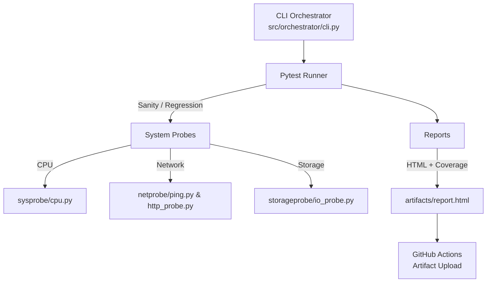

🧩 graviton-sdet-lab

A Linux-based test automation framework (pytest) for CPU, Network, and Storage validation. Runs in parallel, generates HTML & coverage reports, supports Docker and GitHub Actions CI.

🚀 Features

CPU/OS probes: /proc, lscpu, /etc/os-release

Network probes: ICMP ping, HTTP latency (YAML thresholds)

Storage probe: read/write throughput verification

Suite markers: sanity (fast) / regression (deep)

Config-driven: config.yaml for latency/throughput limits

Parallel runs: pytest-xdist

HTML & coverage: pytest-html, pytest-cov

Dockerized + CI-ready

⚙️ Installation (Linux / WSL2)
git clone https://github.com/<your-username>/graviton-sdet-lab.git
cd graviton-sdet-lab
python3 -m venv .venv && source .venv/bin/activate
pip install -U pip -r requirements.txt

🧪 Running Tests

Sanity (fast):

python -m src.orchestrator.cli --suite sanity -n 2 --html sanity.html

Regression (deeper):

python -m src.orchestrator.cli --suite regression -n 2 --html regression.html

Open the HTML report (on Windows):

explorer.exe artifacts/sanity.html

🧱 Docker Usage

Build & run:

docker build -t graviton-sdet-lab .
docker run --rm -v "$(pwd)/artifacts":/app/artifacts graviton-sdet-lab

This runs the sanity suite inside a clean Linux container and writes the report to artifacts/sanity.html.

⚙️ CI/CD (GitHub Actions)

Workflow: .github/workflows/ci.yml

Installs dependencies

Runs pytest -m sanity

Uploads HTML & coverage artifacts

Badge (replace with your username):

## 🧭 Architecture Overview

🧠 Why It Matters

Demonstrates framework design, test layering, and CI/CD

Shows Linux + automation experience aligned with Amazon SDE/SDET

Extensible via config + thresholds; reproducible with Docker

🛠️ Tech Stack

Python · pytest · PyYAML · Docker · GitHub Actions · Linux (WSL2)

@contact
Suleiman Khasheboun
📧 suli.tempmail2022@gmail.com
